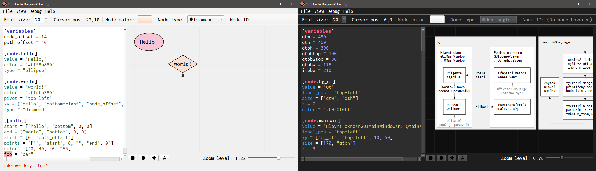

# DiagramPche :: Qt

This is part of a IMGUI paradigm research, [go back to main repo](https://github.com/RadekMocek/DP).

* Jump to:
  * [Building locally](#building-locally)
  * [Dependencies](#dependencies)
  * [Problems](#problems)



## Building locally

(This guide works with Qt version 6.10.0. If you have a newer version, replace `6.10.0` in all paths accordingly.)

### Debian based distros

* Download Qt from <https://www.qt.io/> and install it, then:

```bash
sudo apt install cmake ninja-build libxcb-cursor0 libxcb-cursor-dev

export QTDIR=<path_to_qt_installation>/6.10.0/gcc_64/
export QT_DIR=<path_to_qt_installation>/6.10.0/gcc_64/
export Qt6_DIR=<path_to_qt_installation>/6.10.0/gcc_64/
# ↑ Add these lines to ~/.bashrc for auto export

# Navigate to the root directory of this repository

cmake -S . -B build

cmake --build build
```

* To make it work in CLion on Linux:
  1. Open the project in CLion
  2. Click on the CMake icon at the bottom left corner
  3. Click on the cogwheel icon → _CMake settings_
  4. In the _Cache variables_ section of the settings, and change:
     * _Value_ of _Name_ `Qt6_DIR` to `<path_to_qt_installation>/6.10.0/gcc_64/lib/cmake/Qt6`
     * _Value_ of _Name_ `QT_DIR` to `<path_to_qt_installation>/6.10.0/gcc_64/lib/cmake/Qt6`

### Windows with Visual Studio

* Download Qt from <https://www.qt.io/> and install it, the only component needed is _Qt_ → _Qt 6.10.0_ → _MSVC 2022 64-bit_
* Create a new system environment variable called `QTDIR` with value: `<path_to_qt_installation>\6.10.0\msvc2022_64`
* Add two new values to system environment variable PATH:
  * `%QTDIR%\bin`
  * `%QTDIR%\dir`
* In Visual Studio's launcher, click on the _Open a local folder_ button and select root directory of this repository

### Windows with CLion

To run working Visual Studio project from the previous section in CLion, a _Visual Studio toolchain_ must be set up. See [Tutorial: Configure CLion on Windows](https://www.jetbrains.com/help/clion/quick-tutorial-on-configuring-clion-on-windows.html).

An alternative approach would be to choose the _MinGW_ component instead of _MSVC_ during the Qt installation, set environment variables accordingly, and then run the project directly in CLion. I haven't tested that, though.

## Dependencies

* [Qt](https://www.qt.io/development/qt-framework) ([LGPL](https://doc.qt.io/qt-6/lgpl.html))
* [toml++](https://github.com/marzer/tomlplusplus) ([MIT](https://github.com/marzer/tomlplusplus/blob/master/LICENSE))
* [qcoro](https://github.com/qcoro/qcoro) ([MIT](https://github.com/qcoro/qcoro/blob/main/LICENSE))
* David Robert Nadeau's `getCurrentRSS` (CC BY 3.0)
* [cpp-linux-system-stats](https://github.com/improvess/cpp-linux-system-stats) ([Apache-2.0](https://github.com/improvess/cpp-linux-system-stats/blob/main/LICENSE))

<br>

* [Inconsolata](https://levien.com/type/myfonts/inconsolata.html) ([SIL Open Font](https://github.com/google/fonts/blob/main/ofl/inconsolata/OFL.txt))
* [QtAwesome](https://github.com/gamecreature/QtAwesome) ([MIT + CC BY 4.0 + SIL OFL 1.1](https://github.com/gamecreature/QtAwesome/blob/main/LICENSE.md))

## Problems

### Visual problems

* Icons stay black after changing to dark mode (ideally, they should switch to white as the rest of the font)
* Minor syntax highlight issues:
  * Highlights commented string as normal string
  * `points = [["", "start", 0, "", "end", 0]]` – first zero is green (not red) for some reason
  * On Linux the `node`/`path` keywords are not bold (Windows OK), this is not a big issue since other projects do not support bold font in text editor at all

### UX problems

* On Windows (Linux OK), when dragging canvas via RMB and then releasing RMB outside of canvas on some other widget (e.g. textedit), a context menu for that widget appears, as if we right-clicked on that widget intentionally

### Differences to IMGUI projects

* Settings in preferences window, that can also be changed from toolbar/menubar: Their values won't get updated immediately in settings window if they are changed from those other places (they get updated after reopening the preferences window). Preferences window also has an 'apply all' button (instead of changing settings immediately). This could be improved, but would require additional logic.
